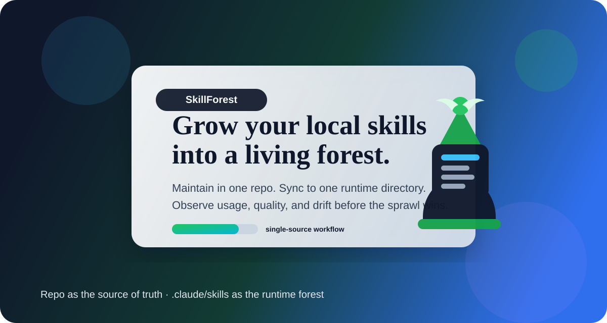

<p align="center">
  
</p>

<h1 align="center">SkillForest</h1>

<p align="center">
  当你的本地 skills 越长越野，SkillForest 负责把它们养成一座能维护、能迁移、能复用的森林。
</p>

<p align="center">
  <a href="README_EN.md"><strong>English</strong></a>
  ·
  <a href="#快速开始"><strong>快速开始</strong></a>
  ·
  <a href="#同步到本机运行目录"><strong>同步</strong></a>
  ·
  <a href="#faq"><strong>FAQ</strong></a>
</p>

<p align="center">
  
  
  
  
</p>

> 不是又一个 skills 仓库，而是你本地 skill 生命周期的控制台。

你可能已经见过这种场景：

- 技能装了很多，但没人说得清现在到底有哪些
- `.claude/skills`、本地备份、GitHub 仓库三份内容越改越分叉
- skill 名称越来越多，来源越来越杂，最后谁还在用、谁该删、谁值得保留，全靠记忆
- 想分享一套可复用的本地 skill 环境，却发现没有统一入口和同步路径

**SkillForest** 做的事很直接：

- 用仓库维护 skills
- 用脚本同步到运行目录
- 用注册表和 GUI 看清这片森林
- 用评分和使用数据持续修剪它

[快速开始](#快速开始) · [日常工作流](#日常工作流) · [同步到本机运行目录](#同步到本机运行目录) · [仓库结构](#仓库结构) · [推荐技能](#推荐技能) · [FAQ](#faq)

---

## 它解决什么问题

如果你的本地 skills 越装越多，迟早会遇到这些问题：

- 不知道现在到底装了哪些 skill
- 看不懂 skill 名称，前缀太多，说明太弱
- 想搜索、分类、筛选、整理，但没有统一入口
- 技能库可以用，却很难维护、迁移、分享

SkillForest 的目标很简单：让本地 skills 变成一套可管理、可观察、可持续优化的技能系统，而不是一堆散落目录。

## 当前包含的核心能力

- 本地 skills 注册表
- 可视化技能管理界面
- 技能分类、用途说明和来源记录
- 远程搜索并导入新 skill
- 技能使用频率、评分和运营面板
- 当前本地技能库的同步快照
- 从仓库一键同步到本机运行目录的脚本

## 为什么它有点不一样

很多 skill 仓库解决的是“怎么多装几个 skill”。

SkillForest 更关心的是另一件事：

- 哪些 skill 真的在用
- 哪些 skill 已经分叉
- 哪些 skill 值得保留、重写、迁移或下线

换句话说，它既是 skill 仓库，也是 skill 运营台。

## 快速开始

如果你只想 3 分钟上手，按这个顺序：

1. 看仓库结构：`skills/`、`skill-registry/`、`tools/`
2. 只在仓库里维护 skill：`skills/<skill-name>/`
3. 同步到本机运行目录：

Windows：

```bat
tools\sync_to_claude_skills.bat
```

Python：

```bash
python tools/sync_to_claude_skills.py --prune
```

4. 打开本地 GUI：

```bat
skill-registry\launch_skill_registry_gui.bat
```

## 日常工作流

推荐把 `skill-repo` 当成唯一维护源。

不要把 `~/.claude/skills` 当成手工编辑目录。更稳的工作流是：

1. 只修改仓库里的 `skills/<skill-name>/`
2. 提交并推送仓库
3. 用同步脚本把仓库内容发布到本机运行目录
4. 在 OpenCode 里实际触发和使用这些 skill

这样做的好处是：

- 本地运行目录不会和 Git 仓库双向打架
- GitHub 永远是你的可回滚历史
- 换机器时只需要 clone 仓库再同步一次

## 同步到本机运行目录

仓库已经提供同步脚本，路径都以仓库根目录为基准，不依赖某个人的绝对路径。

### Windows

```bat
tools\sync_to_claude_skills.bat
```

只预览、不真正写入：

```bat
tools\sync_to_claude_skills.bat --dry-run
```

### Python 方式

```bash
python tools/sync_to_claude_skills.py --prune
```

脚本行为：

- 源目录：仓库内 `skills/`
- 目标目录：当前用户主目录下的 `.claude/skills`
- 默认保留 `skill-registry/` 等运行支撑目录
- `--prune` 会删除本机运行目录中仓库里不存在的 skill

换句话说：**仓库是设计稿，`.claude/skills` 是发布目录。**

## 仓库结构

### `skill-registry/`

这是整个项目的核心管理模块，放的是技能注册表维护和图形界面相关文件。

- `SKILL.md`：skill 说明文件
- `skill_registry_gui.py`：图形界面主程序
- `launch_skill_registry_gui.bat`：Windows 启动器
- `launch_skill_registry_gui.command`：macOS 启动器
- `README.md`：这个模块自己的说明文档

### `skills/`

这是你真正应该维护的技能库主目录，适合：

- 做备份
- 做迁移
- 分享给别人直接复用
- 统一整理多来源的 skills
- 作为 GitHub 上的单一真值来源

### `tools/`

这里放的是工程化辅助脚本，比如：

- `package_skillforest_release.py`：打包发布目录
- `sync_to_claude_skills.py`：同步到 `.claude/skills`
- `sync_to_claude_skills.bat`：Windows 下一键同步入口

### `docs/`

这里放的是使用说明、结构说明和发布说明，不是程序本体。

## GUI 现在能做什么

当前界面已经支持：

- 左侧分类导航
- 中间技能卡片浏览
- 右侧详情面板
- 远程搜索和一键安装
- 鼠标滚轮浏览卡片
- 按添加时间、评分、使用次数排序
- 自动读取 OpenCode 真实 skill 调用记录
- 统计每个 skill 的使用次数、最近使用时间和评分
- 展示技能运营面板，包括高频技能、近 7 天活跃、沉睡技能和总调用次数

## 安装方式

至少复制下面这个目录到目标机器：

- `skill-registry/` -> 当前用户主目录下的 `.claude/skills/skill-registry`

如果你还想把当前技能库一起同步过去，再复制：

- `skills/` -> 当前用户主目录下的 `.claude/skills`

详细步骤见 `docs/INSTALL.md`。

## 启动 GUI

Windows：

- `skill-registry/launch_skill_registry_gui.bat`

macOS：

- `skill-registry/launch_skill_registry_gui.command`

也可以手动运行：

```bash
python "%USERPROFILE%\.claude\skills\skill-registry\skill_registry_gui.py"
```

macOS 下：

```bash
python3 "$HOME/.claude/skills/skill-registry/skill_registry_gui.py"
```

## 推荐技能

如果你刚开始使用这套技能库，建议先从这些高频核心 skill 开始：

| Skill | 作用 |
| --- | --- |
| `humanizer` | 把文案、说明、周报改得更自然 |
| `find-skills` | 按需求搜索适合的新 skill |
| `skill-creator` | 创建、重构和优化 skill |
| `skill-registry` | 管理本地 skills、维护注册表、打开 GUI |
| `frontend-design` | 让前端输出更有美感、更有设计系统意识 |
| `cek-context-engineering` | 优化 prompt、command、skill 的上下文设计 |
| `cek-root-cause-tracing` | 沿调用链倒推 bug 根因 |
| `cek-do-in-parallel` | 把任务拆成并行子任务执行 |
| `sp-systematic-debugging` | 用系统化方法定位复杂问题 |
| `tob-codeql` | 做静态安全分析和漏洞审计 |

如果你更偏工程交付，也建议优先看：

- `cek-plan`
- `cek-implement`
- `cek-create-pr`
- `devops-dockerfile-generator`
- `devops-k8s-yaml-validator`

## 快速导航

| 路径 | 作用 |
| --- | --- |
| `skill-registry/` | 核心目录，包含 GUI、启动器、注册表维护逻辑 |
| `skills/` | 当前本地 OpenCode skills 的同步快照与维护源 |
| `docs/INSTALL.md` | 安装说明 |
| `docs/SKILLS_REGISTRY_README.md` | 注册表结构、字段和维护规则 |
| `docs/SKILLS_USAGE_GUIDE.md` | 常用 skill 的适用场景和用法 |
| `docs/CEK_SKILLS_INDEX.md` | CEK 系列技能索引 |
| `docs/SKILLS_REGISTRY.template.csv` | 注册表模板 |
| `docs/RELEASE.md` | 打包和发布说明 |
| `tools/package_skillforest_release.py` | 一键生成发布目录和 zip 包 |
| `tools/sync_to_claude_skills.py` | 把仓库内 `skills/` 同步到本机运行目录 |
| `tools/sync_to_claude_skills.bat` | Windows 下一键同步本机 skill 目录 |

## FAQ

### 我到底应该维护哪一处？

只维护仓库里的 `skills/`。

### `~/.claude/skills` 还要不要手改？

不建议。把它当作运行目录，通过同步脚本生成即可。

### 绝对路径会不会影响别人用？

不会。同步脚本使用仓库相对路径和当前用户主目录，不依赖某个人的机器路径。

### 我能把这套库发给别人吗？

可以。别人 clone 仓库后，运行同步脚本，就能把 skills 发布到自己的 `.claude/skills`。

## 当前状态

这不是一个展示型仓库，而是一套正在持续打磨的本地技能管理工作台。重点不在“列出所有 skill”，而在于：

- 让 skill 看得懂
- 让 skill 找得到
- 让 skill 用得起来
- 让 skill 的价值能被观察和整理

如果你已经厌倦了“本地 skills 能跑，但没人知道它们现在是什么状态”，SkillForest 就是用来把这件事重新变清楚的。
