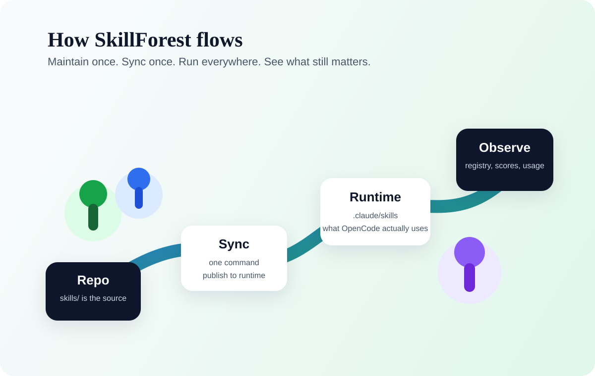

<p align="center">
  
</p>

<h1 align="center">SkillForest</h1>

<p align="center">
  When your local skills start growing wild, SkillForest turns them into a forest you can actually maintain.
</p>

<p align="center">
  <strong>Maintain once. Publish once. See the whole forest clearly.</strong>
</p>

<p align="center">
  <a href="README.md"><strong>中文</strong></a>
  ·
  <a href="README_EN.md"><strong>English</strong></a>
  ·
  <a href="#quick-start"><strong>Quick Start</strong></a>
  ·
  <a href="#sync-to-your-local-runtime"><strong>Sync</strong></a>
  ·
  <a href="#faq"><strong>FAQ</strong></a>
</p>

<p align="center">
  
  
  
  
</p>

> Not just another skill dump. This is a control panel for your local skill lifecycle.

<p align="center">
  
</p>

You have probably seen this happen:

- you keep installing skills, but nobody knows what is still active
- `.claude/skills`, local backups, and GitHub drift apart
- prefixes multiply, descriptions get vague, and cleanup becomes guesswork
- you want to share a reusable local setup, but there is no single source of truth

SkillForest gives you a simple operating model:

- maintain skills in one repo
- sync them into one runtime directory
- track them with a registry and GUI
- prune the forest with quality and usage data

## Quick Start

If you only want the shortest path:

1. Maintain skills only inside `skills/`
2. Commit and push the repo
3. Sync into your local runtime directory

Windows:

```bat
tools\sync_to_claude_skills.bat
```

Python:

```bash
python tools/sync_to_claude_skills.py --prune
```

4. Open the GUI:

```bat
skill-registry\launch_skill_registry_gui.bat
```

## Daily Workflow

Treat `skill-repo` as your only hand-edited source.

Do not manually edit `~/.claude/skills` unless you are debugging something urgent.

Recommended loop:

1. edit `skills/<skill-name>/`
2. commit and push
3. sync to `.claude/skills`
4. test the skill in OpenCode

This keeps GitHub history clean and prevents the runtime directory from drifting away from the repo.

## Sync to Your Local Runtime

The repo ships with sync tools that avoid machine-specific absolute paths.

Windows:

```bat
tools\sync_to_claude_skills.bat
```

Preview only:

```bat
tools\sync_to_claude_skills.bat --dry-run
```

Python:

```bash
python tools/sync_to_claude_skills.py --prune
```

Behavior:

- source: repo `skills/`
- target: current user's `.claude/skills`
- preserves runtime support directories like `skill-registry`
- `--prune` removes local skill directories that no longer exist in the repo

In short: **the repo is the source of truth, `.claude/skills` is the published runtime copy.**

## What Makes This Different

Most skill repositories optimize for accumulation.

SkillForest optimizes for stewardship:

- which skills are actually being used
- which ones have drifted
- which ones are worth keeping, rewriting, migrating, or deleting

That makes it both a skill repository and a skill operations layer.

## One Diagram, One Mental Model

- maintain `skills/` inside the repo
- publish into `.claude/skills`
- observe drift, quality, and usage through the registry layer
- prune what no longer earns its place in the forest

## Repository Layout

| Path | Purpose |
| --- | --- |
| `skill-registry/` | GUI, launchers, and registry tooling |
| `skills/` | the real maintenance source for skills |
| `tools/` | packaging and sync utilities |
| `docs/` | installation, registry, and release documentation |

## Recommended Skills

Start with these if you are new to the library:

| Skill | Why it matters |
| --- | --- |
| `humanizer` | makes writing feel less robotic |
| `find-skills` | helps you discover missing capabilities |
| `skill-creator` | creates and improves skills |
| `skill-registry` | manages your local library and opens the GUI |
| `frontend-design` | pushes UI work away from generic templates |
| `cek-root-cause-tracing` | traces bugs back to the actual trigger |
| `sp-systematic-debugging` | gives debugging a disciplined workflow |

## FAQ

### Which copy should I maintain?

Only the repo copy under `skills/`.

### Should I edit `~/.claude/skills` directly?

Prefer not to. Treat it as a runtime directory generated by the sync script.

### Will this work on another machine?

Yes. The sync script resolves the current user's home directory automatically.

### Can I share this with other people?

Yes. They can clone the repo and sync into their own `.claude/skills`.

## Current Status

SkillForest is not meant to be a static showcase. It is a working skill operations desk.

The real goal is simple:

- make skills understandable
- make skills findable
- make skills usable
- make skill value visible over time
